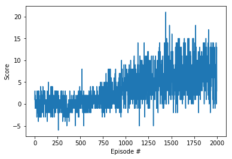
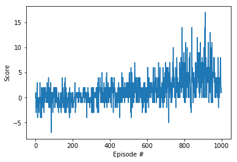
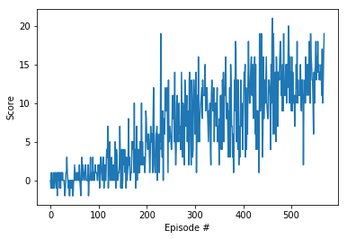
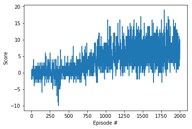
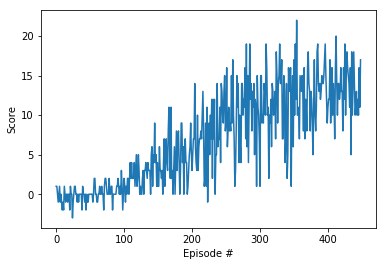
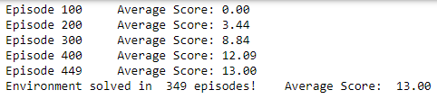

## Udacity Deep Reinforcement Learning Nanodegree
### Project 1: Navigation

##### &nbsp;

### Report
#### 1. Arquitecture components

*Deep Q-Networks*: The soul of the systems relies on the Reinforcement Learning field, specifically on the Deep Q-Network architecture (DQN). The main goal of these types of architectures is to find the Action-Value function `Q(s, a)`, which represents the evaluation in the state `s` of the action `a`.  This is achieved in DQN throw Deep Neural Networks systems, giving `s` as the input and expecting `Q(s, a)` in the output. It is worth noticing there are many actions available per state, therefore the architecture returns all `Q` values for all of them in one single pass.

*Experience Replay:* DQN on its own is not that powerful; these types of agents tend to forget old experiences and focus on recent ones, making its structure quite unstable. Experience replay solves this problem by stacking these experiences in temporal memory and replaying them into the agent.

*Prioritized Experience Replay*: Experience Replay does an incredible job upgrading DQN systems, but  still some upgrades can be made by prioritizing some experiences more than others based on the Temporal Difference error, which establishes the difference between the computed `Q(s, a)` and the new `Q(s', a)` with the given reward from state `s`. This difference tells us if something unexpected happens to the agent and therefore is necessary to keep learning from that experience.

*Double DQN*: Another extension of the DQN architecture is to add a second Deep Neural Network (the target network) that updates every time the original (or local network) finishes its training in every step. In every new learning step, the local network tries to outperform the target network containing the updates from the last backpropagation. To make this even more stable, there can be added a new hyperparameter τ to merge a percentage of the local network with the target network.

*Dueling Network*: Finally, this extension of the DQN proposes a different output for the neural network, where instead of returning `Q(s, a)` directly, it can return the State-Value function and the advantage values of the actions denoted `A(s, a)`. In this case, to obtain the `Q(s, a)` it would be necessary to add both the State-Value with the advantage values of each action.

#### 2. Hyperparameters

The hyperparameter selection was based on the recommendations from the [Rainbow paper](https://arxiv.org/pdf/1710.02298.pdf) by Deep Mind, with some modifications in the batch size and the replay buffer.

  | Parameter                           | Value         |
  | ----------------------------------- | ------------- |
  | Replay buffer size                  | 1e5           |
  | Batch size                          | 64            |
  | Discount Factor γ                   | 0.99          |
  | Soft Update τ                       | 1e-3          |
  | Adam learning rate α                | 6.25e-5       |
  | Prioritization type                 | Proportional  |
  | Prioritization exponent ω           | 0.5           |
  | Weights correction β                | 0.4           |
  | Correction increase rate            | 4e-5          |
  | Multi-step                          | 3             |
  | Number of episodes                  | 2000          |
  | Exploration ε                       | 1.0           |
  | Epsilon minimum                     | 0.1           |
  | Epsilon decay                       | 0.99          |

#### 3. Results

To gain some understanding of each extension of the DQN architecture, every single one of these was added alone to the architecture and then checked its results, which are listed above along with the vanilla DQN:

| DQN                          | Prioritized DQN                                  | Double DQN                           | Dueling DQN                              |
|------------------------------| ------------------------------------------------ | ------------------------------------ | ---------------------------------------- |
|  |  |  |  |

Neither DQN nor Prioritized Replay nor Dueling DQN networks completed the environment in less than 1000. This, along with some lack of hyperparameters searching, suggests that the DDQN extension provides a good amount of stability to the learning process. The Double DQN agent solved the environment in 469 episodes, but its plot reward will not be presented since the mini-rainbow agent (mini-rainbow, since I could not finish all extensions, explained in the paper) did it in fewer episodes.

Finally, the results of the agent with all three extensions is provided below:
| Training Graph                           | Reward Plot                            |
| ---------------------------------------- | -------------------------------------- |
|   |  |

The weights of this agent are presented in the `model.pth`.

#### 4. Ideas for Future Work

1. Add the missing extensions presented in the Rainbow paper, which are [Noisy Networks](https://arxiv.org/pdf/1706.10295.pdf) and [Distributional Reinforcement Learning](https://arxiv.org/pdf/1707.06887.pdf).
2. Search for hyperparameters that fit better to the environment.
3. Implement a Q-Network that takes raw pixels from the environment instead of the 37-dim state space used in this project.
